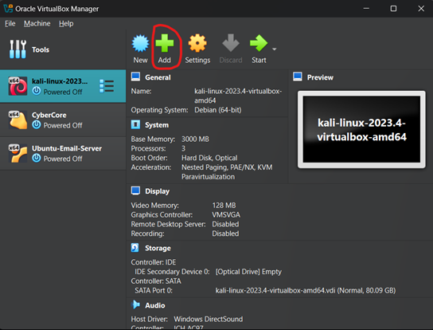

## Virtual Box and Hyper-V Virtual Machine Setup

**Virtual Box VM set up on Windows**

Luckily most windows systems now have enough resources to run both the virtual machine and its hosting software. Main issue would be hard drive space, ensure you have enough room for the OSI image and any extra storage. If you are planning on running a lot or intensive services on a virtual machine, you’ll also need to increase the amount of RAM and CPU cores that it can use. As always if you have any questions, please reach out to any of the club officers!

<ins>Download and extract software</ins>

Virtual Box: https://www.virtualbox.org/wiki/Downloads
7-ZIP: https://7-zip.org/
Kali: https://cdimage.kali.org/kali-2024.3/kali-linux-2024.3-virtualbox-amd64.7z
Kali for Hyper-V (Optional): https://cdimage.kali.org/kali-2024.3/kali-linux-2024.3-hyperv-amd64.7z

If you are unsure about what to do with these files please refer to [Windows Virtual Machine Installation Guide](./windows_installation_guide.html) or ask a club officer.

<ins>Kali Set Up on Virtual Box</ins>

<ins>Step 1:</ins> Navigate to Virtual Box and click "add"/

<ins>Step 2:</ins> Navigate to the extracted Kali folder and select .vbox then click "open".

<ins>Step 3:</ins> Double click on the new Kali machine.

<ins>Step 4:</ins> Wait for Kali to boot. The username and password are both "kali".

Congratulations, your Kali VM on Virtual Box is all set!

**Hyper-V VM set up on Windows**

This part is optional as using Virtual Box or VMware both work well. It should be noted that Hyper-V isn’t a supported feature nor is it offered for Windows 10 , or 11 home edition. However, we can still enable it. NOTE: the set up for this can be a bit complicated, if you need help be sure to ask a club officer. It's possible that enabling Hyper-V on an OS that doesnt "offically" support it may break EULA.

<ins>NOTE:</ins> Hyper-V is picky about resources. It may not work on systems with < 8 GB of RAM.

Reference Links:

https://gist.github.com/HimDek/6edde284203a620745fad3f762be603b
https://techcommunity.microsoft.com/t5/educator-developer-blog/step-by-step-enabling-hyper-v-for-use-on-windows-11/ba-p/3745905
https://www.kali.org/docs/virtualization/install-hyper-v-guest-vm/

<ins>Step 1:</ins> Checking Compatibility

1. Press windows key + "r" then search for "msinfo32" then press "enter"
2. Scroll down in "System summary" until you see "Hyper-V Requirements"
3. If it's "yes" or “A hypervisor has been detected. Features required for Hyper-V will not be displayed.” You’re all set

<ins>Step 1.5:</ins> Only for Windows 10 - 11 pro or above uses: Enabling Hyper-V

1. Press Windows key + "r" then enter appwiz.cpl.
2. Click on "Turn windows features on or off".
3. Scroll down until you see "Hyper-V" click the check box, press "ok". then when install is complete. Restart the computer.

<ins>Step 2:</ins> Enabling Hyper-V on Windows 10 - 11 Home
**Slightly complex part**

1. Right-Click desktop -> New -> Text Document.
2. Paste the following command into the text document:
    pushd "%~dp0"
    dir /b %SystemRoot%\servicing\Packages\*Hyper-V*.mum >hyper-v.txt
    for /f %%i in ('findstr /i . hyper-v.txt 2^>nul') do dism /online /norestart /add-package:"%SystemRoot%\servicing\Packages\%%i"
    del hyper-v.txt
    Dism /online /enable-feature /featurename:Microsoft-Hyper-V -All /LimitAccess /ALL
    Pause
3. Click File -> Save as -> rename file to "Hyper-V.bat" -> save.
4. Double click "Hyper-V.bat" to run.
    *It may need to be ran as admin: Right-Click -> run as administrator.
5. Once install is done, device will prompt for restart, please restart.
6. Press Windows Key + "r" then enter "appwiz.cpl".
7. Click on "Turn Windows Features on or off".
8. Check the boxes for Hyper-V, Virtual Machine Platform, and Windows Hypervisor Platform then click "ok".
9. Device will restart.

<ins>Step 3:</ins> Kali on Hyper-V

1. Click "Quick Create"

2. Click "Local Installation Source"

3. De-select "This virtual machine will run Windows".
4. Click " Change installation source".
    -Navigate to where you download/extracted Kali's .vhdk file -> select it.
5. Re-name virtual machine to what you want.
6. Click "Create Virtual Machine".
7. Once the virtual machine is fully loaded, the username and password are kali.

Congratulations you’ve set up a Kali VM on Hyper-V!

=^._.^=