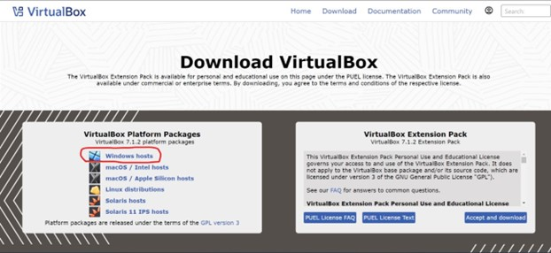
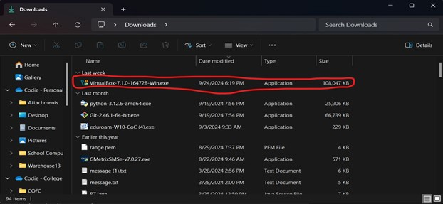
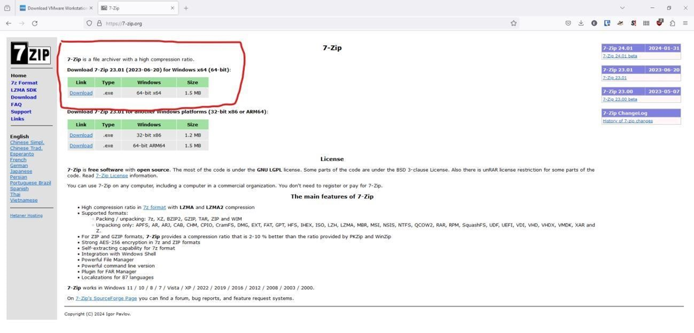
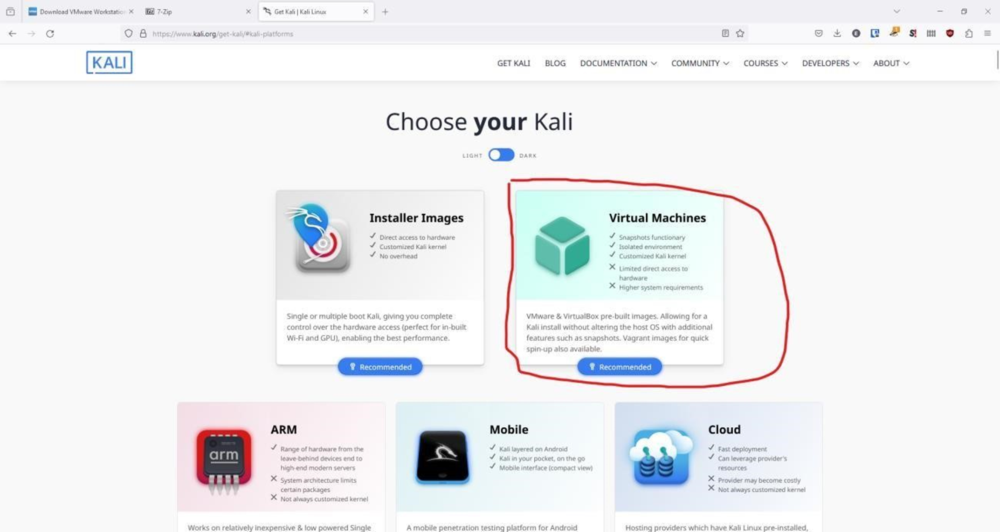
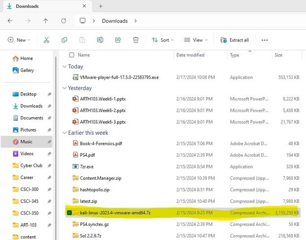
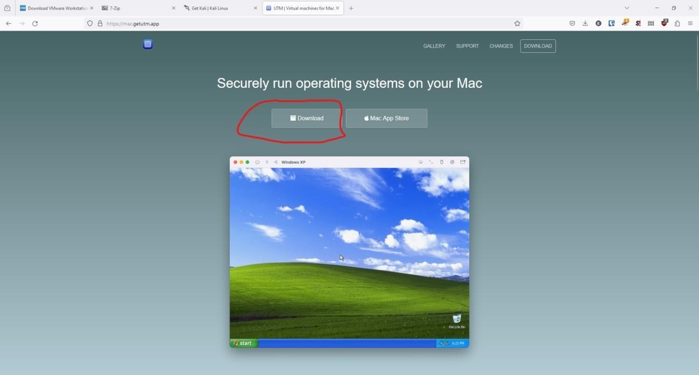
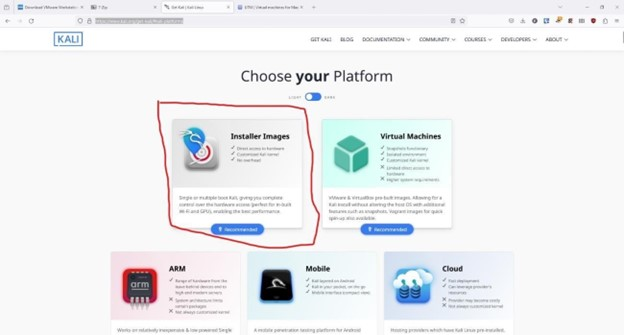
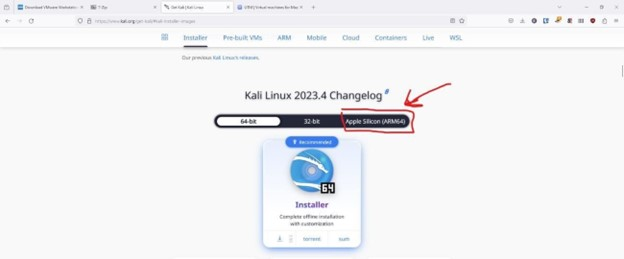
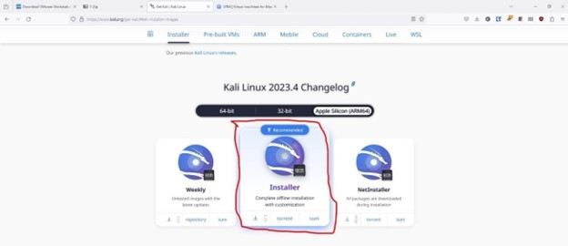

## Virtual Machine Installation Guide

**For Windows OR Intel CPU MacBook:** 

(For those using a M1, M2, M3 processor instructions are below these. if you are unsure which one you are using, feel free to ask any of the club officers in the discord and we can help you out!)

<ins> Step 1: </ins>
First install Virtual Box (this will be the software that will run the virtual machines)
Link: https://www.virtualbox.org/wiki/Downloads

Click the download button that is circled above. Once installed double click the file circle below.

Then follow all prompts provided by Virtual Box.

<ins> Step 2: Install 7-Zip </ins>

We need to install 7-ZIP to extract a download that was compressed using 7-ZIP. Tis is the same concept as regular ZIP folders you are used to just using a different software to ZIP the files. WE can install it using the link below. Download the file from the link below.

Link: https://7-zip.org/

Then double click on the 7zr.exe file and follow the prompts to install 7-ZIP.

<ins>Step 3: Install the Kali Linux prebuilt Virtual Machine</ins>

NExt, we will download the actual operating system we are wanting to use. THis operating system is a version of Debian Linux that is specifically made for cyber security. It comes preinstalled with many tools that we will use in the club and especially for those who are interested in competitions. We will go to the website and download the correct version.

Link: https://www.kali.org/get-kali/#kali-platforms

We want to install the premade Virtual Machine from Kali Linux. TO do this go to the link and select "Virtual Machines" circled below:

Once there you should see the page below. We then want to click on the download corresponding to the VirtualBox circled below:

This will begin downloading the Kali Linux operating system. THis download is around 3 gigabytes in size so it will take some time depending on your internet connection. Once installed it is very important to make sure that your download looks like this shown below. If it does not you may have downloaded the incorrect files. DOuble check you got the file shown below:

Once it is, you are good to go! We will finish the rest of the installation on Tuesday. If you have any questions, please message any of the club officers on Discord!

**MacBook M1, M2, M3 instructions below here:**

For Macs:

<ins>Step 1: Install software to run Virtual Machines</ins>

Since your computer's CPU architecture is different from others you must use different software to make sure your virtual computer can use the physical hardware of your computer such as your CPU and RAM. TO do this, you need to install software called UTM(Univeral Turing Machine). THis can be found on the AppStore howevere, here it does cost money. It can be downloaded below for FREE so make sure unless you just really want to support the developers of the app to use the link to install the software.

Link: https://mac.getutm.app/

Make sure to click this download link on their site that is circled. Then install it like you would any other app on Mac OS. (if you need hep be sure to reach out to Robert Bare for assistance since he is more familiar with this process on Macs).

<ins>Step 2: Install Kali Linux</ins>

THis process will also be a bit different from Windows since you must also download a version of Kali Linux that is able to communicate with your M series CPU. TO do this go to the same site linked below. Then click the circled "Installer Images Icon"

Link: https://www.kali.org/get-kali/#kali-platforms

Once here you should see a page that looks like the one below. We need to make sure we download the Mac compatible Kali. To do this select the "Apple Silicon (ARM64)" option.

Then we just need to download Kali! Just click the "Installer" option to install Kali. The download is around 3 gigabytes so it will take some time.

Once it is installed you are good to go!

=^._.^=