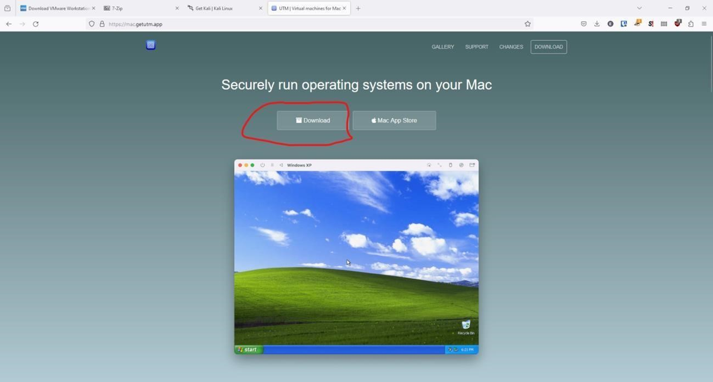
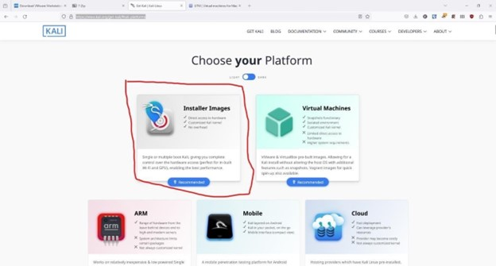

## Mac Virtual Machine Installation Guide

**MacBook M1, M2, M3 instructions below here:**

(For those using a M1, M2, M3 processor instructions are below these. if you are unsure which one you are using, feel free to ask any of the club officers in Discord and we can help you out!)

<ins>Step 1: Install software to run Virtual Machines</ins>

Since your computer's CPU architecture is different from others you must use different software to make sure your virtual computer can use the physical hardware of your computer such as your CPU and RAM. To do this, you need to install software called UTM(Univeral Turing Machine). This can be found on the AppStore however, here it does cost money. It can be downloaded below for FREE so make sure unless you just really want to support the developers of the app to use the link to install the software.

Link: https://mac.getutm.app/

Make sure to click this download link on their site that is circled. Then install it like you would any other app on Mac OS. (if you need hep be sure to reach out to Robert Bare for assistance since he is more familiar with this process on Macs).

<ins>Step 2: Install Kali Linux</ins>

This process will also be a bit different from Windows since you must also download a version of Kali Linux that is able to communicate with your M series CPU. To do this go to the same site linked below. Then click the circled "Installer Images Icon"

Link: https://www.kali.org/get-kali/#kali-platforms

Once here you should see a page that looks like the one below. We need to make sure we download the Mac compatible Kali. To do this select the "Apple Silicon (ARM64)" option.

Then we just need to download Kali! Just click the "Installer" option to install Kali. The download is around 3 gigabytes so it will take some time.

Once it is installed you are good to go! As always, if you have any questions please reach out to a officer on Discord!

=^._.^=